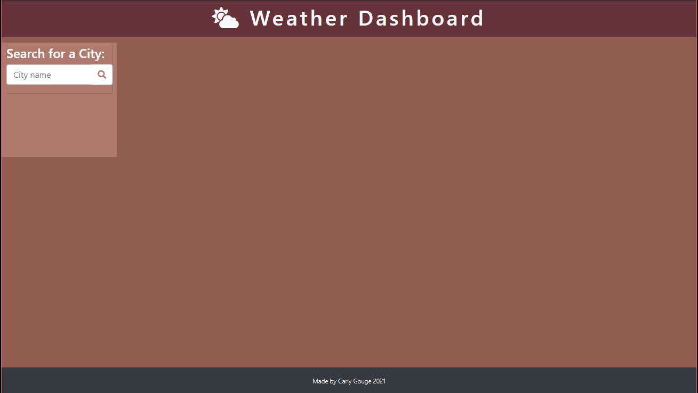
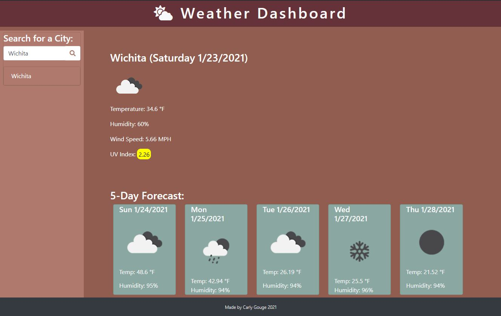
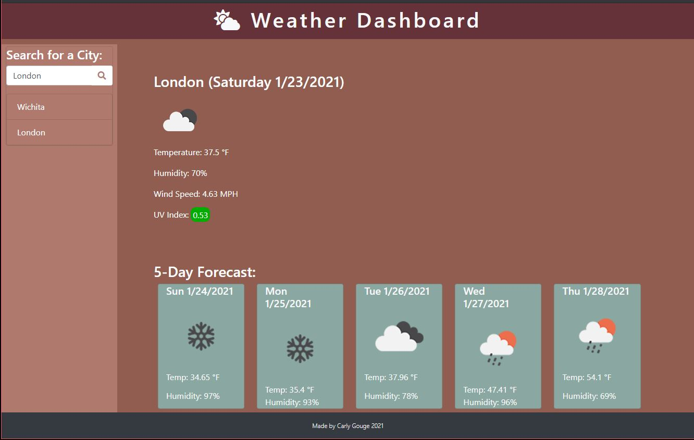

# CGWeatherDashboard
Link to deployed project: https://cgouge93.github.io/CGWeatherDashboard/

This is a weather dashboard created using HTML, Bootstrap / CSS, JavaScript, JQuery, and calls to 3 OpenWatherMap APIs. The dashboard displays current conditions as well as a 5 day forecast for the city entered. Local storage is utilized to save past searches in the sidebar. UV indexes are color-coded depending on severity. 

## Images of Deployed Porject
* 
* 
* 

## GIF of Deployed Project

